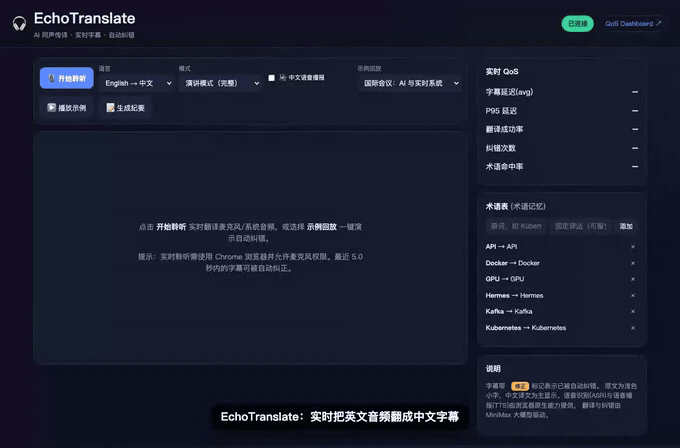

# EchoTranslate · AI 同声传译助手 🎧

> 实时把单向英语 / 日语 / 韩语音频流翻译成**中文滚动字幕**与**中文语音**，并能**自动纠正**之前识别或翻译的错误。
> 面向看英文技术分享、国际会议、网课、产品发布会、直播的用户——核心目标是**降低认知负荷、让你跟上演讲节奏**，而不是逐字翻译。

完整产品设计见 [`design.md`](./design.md)。

---

## 0. 30 秒看懂

| | |
|---|---|
| **痛点** | 用户不是「听不懂单词」，而是「跟不上语速」。 |
| **做法** | 音频 → 实时识别 → 增量翻译 → **自动纠错（字幕回滚）** → 中文字幕 / 语音。 |
| **亮点** | ① 字幕**回滚修正**（Revision Window，最近 N 秒可纠错）② **术语记忆**（Kubernetes 不译成「库伯内特斯」）③ 演讲 / 会议**双模式** ④ 真实 **QoS Dashboard**（延迟 P95/P99、RTF、纠错率、术语命中率）。 |
| **AI** | 翻译与纠错由 **MiniMax 大模型**驱动（实测单段 ~0.9s）；ASR 双后端：Chrome/Edge 用浏览器原生（零延迟），Safari/Firefox 自动改用**百炼 Bailian 云端 ASR**（`paraformer-realtime-v2`）；TTS 用浏览器原生。 |

一键体验：启动后点页面上的 **▶️ 播放示例** —— 用真实 AI 管线复现「storage → distributed storage」「缓存 → 分布式缓存」两处自动纠错。

---

## 1. 快速开始（让人能跑起来）

前置：**Python 3.11**，翻译需 MiniMax API Key。**实时聆听**：Chrome/Edge 用浏览器自带识别；Safari/Firefox 需在 `.env` 配 `DASHSCOPE_API_KEY` 走百炼云端 ASR（不配则这两个浏览器只能用「示例回放」）。

```bash
# 1) 依赖
python3.11 -m venv .venv && source .venv/bin/activate
pip install -r requirements.txt

# 2) 配置密钥（密钥只放在 .env，已被 .gitignore，绝不进仓库）
cp .env.example .env
#   编辑 .env，填入 MINIMAX_API_KEY=sk-...

# 3) 启动
python app.py
#   打开 http://127.0.0.1:8000          （字幕页）
#   打开 http://127.0.0.1:8000/dashboard （QoS 看板）
```

> **没有麦克风 / 不是 Chrome？** 直接用页面上的「**示例回放**」即可完整演示（含自动纠错、术语、纪要）。回放只替换「原文来源」，**翻译与纠错全部由真实 AI 管线实时产生**，不是录播。

### 用 YouTube / 视频原声实测（推荐用来看真实效果）

自己的发音不标准时，用母语原声视频测最准。两种方式：

**A. 抓 Chrome 标签页音频（零额外软件，推荐）**
1. `.env` 配好 `DASHSCOPE_API_KEY`（百炼云端 ASR），重启 `python app.py`。
2. 用 **Chrome** 打开本应用；另开一个 Chrome 标签页播放 YouTube 视频。
3. 应用里设：**语言** = 视频语言（如 English）、**识别引擎** = 自动 / 云端百炼、**音频源** = `标签页/系统音频`。
4. 点 **🎙️ 开始聆听** → Chrome 弹出共享框 → 选「**Chrome 标签页**」→ 选 YouTube 那个标签页 → 勾选左下「**分享标签页音频**」→ 分享。
5. 播放视频，实时中文字幕出现。
   - ⚠️ macOS 上 `getDisplayMedia` 只能抓**标签页**音频，抓不了整个系统/窗口；所以视频要在 Chrome 标签页里播。

**B. 系统音频回环（任意播放器 / Safari / 想用浏览器原生识别时）**
1. 装虚拟声卡：`brew install blackhole-2ch`
2. 「音频 MIDI 设置」→ 新建**多输出设备** = 内置扬声器 + BlackHole 2ch。
3. 系统设置 → 声音 → **输出** = 多输出设备（这样你能听见、声音同时进 BlackHole）。
4. 系统设置 → 声音 → **输入** = BlackHole 2ch。
5. 应用里 **音频源** = `麦克风`（此时系统默认输入就是系统声音），开始聆听 → 播放任意视频。
6. 测完把输入/输出改回正常设备。

跑测试：

```bash
pytest                 # 81 个用例，覆盖率 ~98%（阈值 85%）
```

---

## 2. 它能做什么

- **实时语音识别（ASR）· 双后端**：麦克风 → 增量英文。Chrome/Edge 用浏览器 Web Speech API（零延迟）；Safari/Firefox 自动把 16kHz PCM 经 WebSocket 流给服务端 → **百炼 `paraformer-realtime-v2`** 增量识别。识别引擎可在界面手动切换（自动 / 浏览器 / 云端百炼）。
- **增量翻译**：每个语句一落地立即翻成中文，无需等整段说完。
- **自动纠错 / 字幕回滚**（核心）：最近 `REVISION_WINDOW_SEC`（默认 5s）内的字幕可被**就地更新**，带 `修正` 标记并高亮，旧译文以删除线短暂保留。
- **术语记忆**：术语表里的词（Kubernetes / Kafka / Redis / Hermes …）固定译法、不被音译；可在侧栏增删，新增后会**回溯重渲染**窗口内相关字幕。
- **中文语音播报（TTS）**：浏览器 `SpeechSynthesis`，可开关。
- **演讲 / 会议双模式**：演讲＝完整流畅；会议＝低延迟简洁。
- **会议纪要**：一键把整场译文压缩成要点（AI Summarize）。
- **导出**：双语对照 **HTML / Markdown / SRT 字幕 / CSV / 纯文本**（左英右中、带时间戳与 `修正` 标记）；云端/标签页音频会话还可导出**多媒体 HTML**——单文件内嵌音频播放器，播放时高亮当前句、点句可跳转（音频经服务端的会话才有）。
- **历史记录 & 埋点**：会话 / 字幕 / 事件落 SQLite。
- **QoS Dashboard**：实时延迟 avg/P95/P99、RTF、翻译成功率、纠错率、术语命中率，并对照 `design.md §12` 目标值标注达标 / 未达标。

---

## 3. 架构

```
浏览器                                    Flask 服务端 (app.py)
┌───────────────────────────┐            ┌─────────────────────────────────────────┐
│ ASR 二选一:                │  文本帧     │                                          │
│  · Web Speech (Chrome/Edge)┼─ WebSocket ┼─► ASRIngestor ─► TranslationEngine ──┐   │
│  · 麦克风PCM(Safari/FF) ───┼─  /ws  ────┼─► CloudASR(百炼)──┘ (segment   (MiniMax │   │
│ SpeechSynthesis (TTS) ◄────┼─  二进制帧  │   paraformer-rt     生命周期)  翻译+术语)│   │
│ 字幕渲染 / 回滚修正 / 术语  │            │                                      ▼   │
└───────────────────────────┘            │   RevisionWindow ◄── 自动纠错 ── AIService│
                                         │   MetricsCollector(QoS)   Store(SQLite)  │
                                         └──────────────┬───────────────────────────┘
                                                        └─► /dashboard (QoS 看板)
```

**模块（关注点分离，均可单测）**

| 文件 | 职责 |
|---|---|
| `ai_service.py` | 统一 AI 后端：`translate / retranslate / summarize`；MiniMax-Text-01 主用，M2 → Hermes 故障转移；剥离 thinking、429/5xx 重试切换；**可注入 completer 以离线测试**。 |
| `asr_engine.py` | 段生命周期：interim/final、窗口内 ASR 修订检测。 |
| `asr_cloud.py` | 百炼云端 ASR 兜底：封装 dashscope `paraformer-realtime-v2`，增量结果回灌管线；recognition 工厂可注入以离线测试。 |
| `translation_engine.py` | 增量翻译：上下文 + 术语 + 模式策略。 |
| `revision_engine.py` | 纠错策略：窗口判定、术语回溯目标、标记修正。 |
| `glossary.py` | 术语记忆：注入提示 + 命中度量（不做盲替换，避免伪指标）。 |
| `pipeline.py` | 单会话编排：ASR→翻译→纠错→emit，串起度量与持久化。 |
| `metrics.py` | QoS：延迟分位、成功率、纠错率、术语命中率、RTF。 |
| `db.py` | SQLite：sessions / segments / events / glossary / metrics。 |
| `dashboard.py` | 看板蓝图：实时指标 vs 目标值。 |
| `export.py` | 导出渲染：双语 HTML/MD/SRT/CSV/TXT + 内嵌音频的多媒体 HTML（纯函数，易测）。 |
| `app.py` | Flask 路由 + `/ws` WebSocket + 回放接口。 |
| `replay.py` | 可复现 demo 脚本（驱动真实纠错管线）。 |

---

## 4. 关键设计取舍（为什么做 A 不做 B）

- **ASR 双后端：浏览器优先，百炼兜底。**
  Chrome/Edge 的 Web Speech API 真·零延迟，作首选；但 Safari/Firefox 无可用 Web Speech，过去这部分用户直接没法用。于是补一条**服务端 AI ASR 兜底**：浏览器把 16kHz PCM 经 WebSocket（二进制帧）流给服务端 → **百炼 `paraformer-realtime-v2`** 增量识别 → 回灌同一条翻译/纠错管线。两条后端产出统一的 interim/final，下游完全复用。
  （注：MiniMax Anthropic 端点**不接受音频输入**、该 key 也调不动 MiniMax 原生语音，所以服务端 ASR 选了百炼而非 MiniMax。）TTS 仍用浏览器原生 `SpeechSynthesis` 换零延迟。
  取舍点：默认按浏览器能力自动选后端，避免给 Chrome 用户平白增加云端往返延迟；百炼仅在确有需要时才用，省调用、降延迟。
- **翻译模型选 `MiniMax-Text-01`。** 实测对比：Text-01 ≈0.9s 且无 thinking 块；M2 ≈1.7–2.0s 且需剥离 thinking；M3 ≈3.3s。实时场景延迟优先，故 Text-01 主用，M2/Hermes 仅作故障转移。
- **纠错只保留「会真正改变输出」的路径**（ASR 修订 + 术语回溯）。曾实现「用后文上下文回译前句」，但实测对完整句几乎不改变译文，是伪功能，故删去——**只统计真实发生的纠错，不做伪指标**。
- **回放模式是诚实的演示**：只替换「原文来源」，翻译/纠错全部实时由 AI 产生，并在 UI/README 明确标注，避免「造假演示」。

---

## 5. QoS 指标（design.md §12-13）

`/dashboard` 实时展示并对照目标：

| 指标 | 目标 | 说明 |
|---|---|---|
| 字幕延迟 avg | < 2s | 识别提交 → 字幕就绪（服务端单时钟，无时钟漂移） |
| P95 延迟 | < 3s | |
| RTF 实时率 | < 1 | 处理耗时 / 墙钟，<1 表示跟得上 |
| 翻译成功率 | > 95% | |
| 术语命中率 | > 95% | 出现的术语中保持固定译法的比例 |
| 纠错率 | 统计量 | 被回滚修正的字幕比例 |

> 延迟口径诚实说明：服务端度量「识别提交→字幕」这一段（主要是 AI 翻译耗时，实测 P95 ≈1.1s）。浏览器端 ASR 还会再增加约 0.3–1s，UI 另行展示。

---

## 6. 配置项（`.env`）

见 [`.env.example`](./.env.example)。常用：`MINIMAX_API_KEY`、`MINIMAX_MODEL`、`DASHSCOPE_API_KEY`（百炼云端 ASR；留空则 Safari/Firefox 走不了实时聆听）、`REVISION_WINDOW_SEC`、`CONTEXT_SEGMENTS`、`PORT`、`HERMES_ENABLED`（VPN 内故障转移后端）。**密钥只在 `.env`，已被 `.gitignore`。**

---

## 7. 项目结构

```
echo_translate/
├── app.py            ├── ai_service.py      ├── templates/  index.html · dashboard.html
├── config.py         ├── asr_engine.py      ├── static/     app.js · app.css · dashboard.js
├── db.py             ├── asr_cloud.py       ├── tests/    （15 个测试模块，~98%）
│                     ├── translation_engine.py
├── pipeline.py       ├── revision_engine.py ├── requirements.txt · pytest.ini · .coveragerc
├── metrics.py        ├── glossary.py        ├── .env.example · .gitignore
├── dashboard.py      ├── replay.py          └── README.md · design.md · DEMO.md
```

---

## 8. AI 辅助开发声明（design.md §24）

本项目在开发中使用了 AI 辅助。所提交代码均**可运行、测试通过（pytest 81 项 ~98% 覆盖）、README 与实现一致**；架构取舍（模型选型、ASR/TTS 方案、删去伪纠错功能等）均经实测验证，理由见 §4。

## 9. 演示

- **真机录屏（推荐）**：[`demo.mp4`](./demo.mp4) —— 真实场景：Chrome 共享 **YouTube 标签页音频** → **百炼云端 ASR** → 实时中文字幕（带声音）。

端到端走查（实时字幕 → 自动纠错 → 术语 → 纪要 → QoS 看板，**字幕为真实 AI 实时产生**）：



- **带中文画外音的录屏**（推荐）：[`demo/output/echo_translate_demo_narrated.mp4`](./demo/output/echo_translate_demo_narrated.mp4) —— 烧录解说字幕 + 中文 TTS 旁白。
- **无旁白录屏**：[`demo/output/echo_translate_demo.mp4`](./demo/output/echo_translate_demo.mp4)；分镜一览 [`demo/output/storyboard.png`](./demo/output/storyboard.png)；解说字幕轨 [`demo/output/captions.srt`](./demo/output/captions.srt)。
- **讲解脚本**：[`DEMO.md`](./DEMO.md)（5 分钟分镜）。
- **一键复现录屏 + 配音**：见 [`demo/README.md`](./demo/README.md)（Playwright 驱动真实 UI 与 AI 管线，无需麦克风）。
